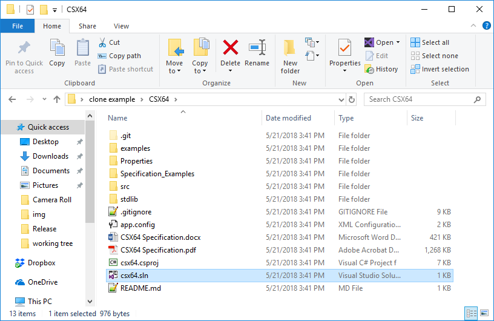
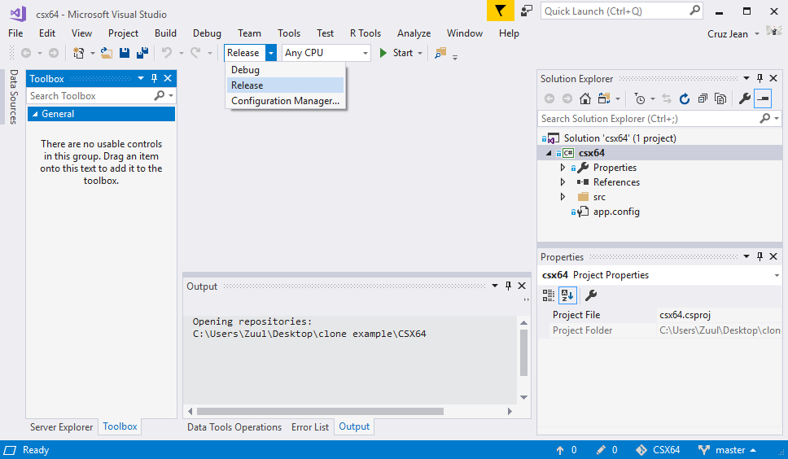
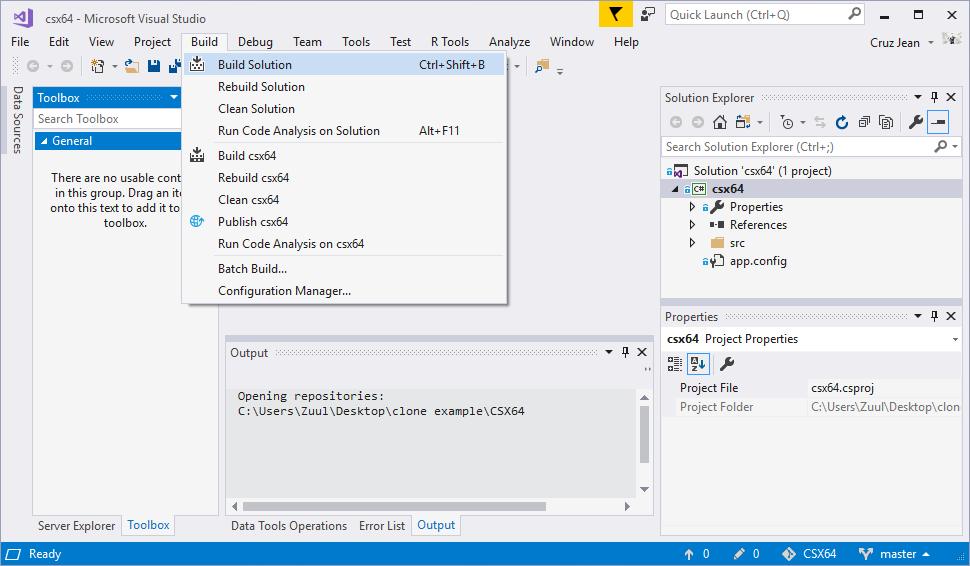
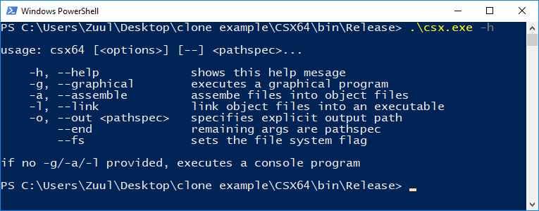

# CSX64
CSX64 is a 64-bit processor emulator (custom instruction set) implemented in C#. It comes with a built-in, thorough assembly language loosely based around Intel x86_64.

CSX64 was designed to be an educational tool for learning low-level programming in a well-documented, safe, emulated environment that is **platform independent**. Additionally, it was designed to be self-contained so that it could be added to other projects (e.g. a Unity game).

All emulation features are held within a single C# class split up over several files in [src/CSX64](src/CSX64). All assembly features are held within [Assembly.cs](src/CSX64/Assembly.cs). The emulator and assembly can function independently, but they both require resources from [Utility.cs](src/CSX64/Utility.cs) and [Types.cs](src/CSX64/Types.cs).

Documentation on the instruction set and assembly language *(as well as other information for users who are trying to learn processor details/assembly language)* are available in [CSX64 Specification](CSX64%20Specification.pdf).

## Getting you own Build
To get your own build of CSX64, we start off with a normal clone, which should give you something like this:

CSX64 was built in [Visual Studio Community 2017](https://www.visualstudio.com/downloads/) *(though older versions should still work)*. After cloning the repo, simply open the `.sln` file (selected in the above image) in VisualStudio. This will bring you to the following window:

Make sure `Release` mode is selected (see above), then select `Build > Build Solution`:

You should now have an executable at `bin/Release/csx.exe`. This is a console application, which I'll demonstrate in PowerShell:

For more information on CSX64, see the [Specification](CSX64%20Specification.pdf).
